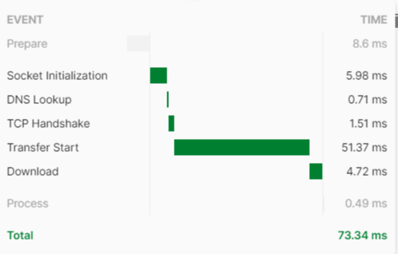

# Fibonacci - Factorial - Ackermann Functions RestApi with Node.js

I have developed this project with node.js and express.
First,i wrote down the functions which we want to see results
And then, i built a restful side.

> Fibonacci

```js
function fibonacci(num) {
  if (num == 0) return 0;
  else if (num == 1) return 1;
  else return fibonacci(num - 1) + fibonacci(num - 2);
}
```

> Factorial

```js
var f = [];
function factorial(n) {
  if (n == 0 || n == 1) return 1;
  if (f[n] > 0) return f[n];
  return (f[n] = factorial(n - 1) * n);
}
```

> Ackermann

```js
function ackermann(m, n) {
  if (m == 0) {
    return n + 1;
  } else if (m > 0 && n == 0) {
    return ackermann(m - 1, 1);
  } else if (m > 0 && n > 0) {
    return ackermann(m - 1, ackermann(m, n - 1));
  } else return n + 1;
}
```

And then i make them a restful services which return a JSON with a RestApi. 

- In the beginning, i created a folder.

> run > cmd

> cd Desktop

> mk dir akinon-test-case


Then,i started a npm module in the terminal of vscode;

> npm init -y

After installations , importing express;

> npm install express

Done.

Then I created a routes folder in the project directory and created the routes.js file in it and the app.js file in the root project directory.

Making configurations of express,server and ports ind app.js

The functions and the http methods that will run them will be implemented in the route.js file.

We will write our http methods in `var appRouter = function(app){}`.

- The Get method for the fibonacci;

```js
app.get("/fibonacci", function (req, res) {
  if (!req.query.sayi) {
    return res.send({ status:400, message: "Sayı Eksik!" });
  }
  if (req.query.sayi < 0) {
    return res.send({ status:400, message: "Sayı pozitif olmalı!" });
  } else {
    result = fibonacci(req.query.sayi);
    return res.send({ status:200, result: result });
  }
});
```

- Factorial

```js
app.get("/factorial", function (req, res) {
  if (!req.query.sayi) {
    return res.send({ status:400, message: "Sayı Eksik!" });
  }
  if (req.query.sayi < 0) {
    return res.send({ status:400, message: "Sayı pozitif olmalı" });
  } else {
    result = factorial(req.query.sayi);
    return res.send({ status: 200, result: result });
  }
});
```

- Ackermann

```js
app.get("/ackermann", function (req, res) {
  if (!req.query.m || !req.query.m) {
    return res.send({ status:400, message: "Sayı Eksik!" });
  }
  if (req.query.m < 0 || req.query.n < 0) {
    return res.send({ status:(400), message: "Sayı pozitif olmalı" });
  } else {
    result = ackermann(req.query.m, req.query.n);
    return res.send({ status: 200, result: result });
  }
});
```


Let's send the requests and test it. I used the Postman application for this.

First of all, we start the server by saying `node.` in the terminal.

```json
PS C:\Users\batuh\Desktop\akinon-test-case> node .
3000... portu dinleniliyor
```

Now let's send the request in Postman

> `GET http://localhost:3000/fibonacci?sayi=9`

Result:

```json
{
  "status": 200,
  "result": 34
}
```

Lets make it with another number:

> `GET http://localhost:3000/fibonacci?sayi=12`

Result:

```json
{
  "status": 200,
  "result": 144
}
```

Factorial için deneyelim:

> `GET http://localhost:3000/factorial?sayi=6`

Result:

```json
{
  "status": 200,
  "result": 720
}
```

For another number:

> `GET http://localhost:3000/factorial?sayi=8`

Result:

```json
{
  "status": 200,
  "result": 40320
}
```

Finally, let's test the Ackermann function

> `GET http://localhost:3000/ackermann?m=2&n=3`

Result:

```json
{
  "status": 200,
  "result": 9
}
```

Let's test it with another dual:
> `GET http://localhost:3000/ackermann?m=1&n=2`

Result:

```json
{
  "status": 200,
  "result": 4
}
```

### Errors

- Let's see what kind of result is returned when Request is written incorrectly..

> ` GET http://localhost:3000/fibonacci?sayi=`

```json
{
  "status": 400,
  "message": "Sayı Eksik!"
}
```

>` GET http://localhost:3000/factorial?sayi=-1`

```json
{
  "status": 400,
  "message": "Sayı pozitif olmalı!"
}
```

>` GET http://localhost:3000/ackermann?m=-1&n=0`

```json
{
  "status": 400,
  "message": "Sayı pozitif olmalı!"
}
```


We ran http requests for the all 3 algorithms,and take a result in JSON format.

### Response Size && Response Time

- Fibonacci  

Response Time:



Response Size:


- Factorial 

Response Time:


Response Size:


- Ackermann 

Response Time:


Response Size:


### -------------------------------------------------------------

For runnig this on your computer,you can follow;

> git clone https://github.com/batuhangedik/akinon-test-case.git

> cd akinon-test-case

> npm install

> node .

these steps.
But its require a Node.js on your machine.